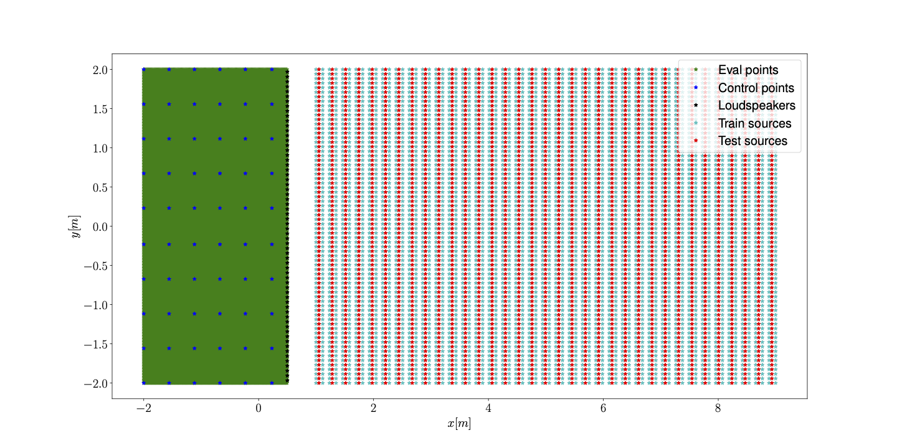
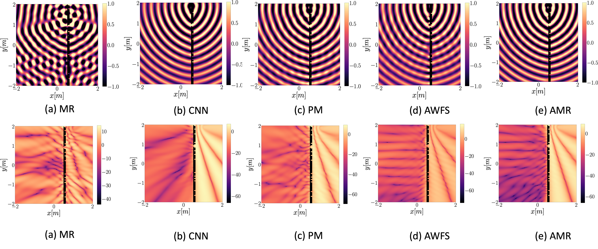
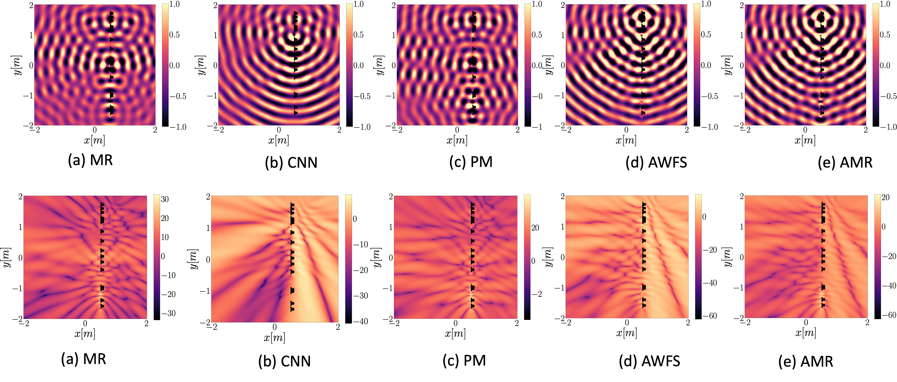

# Irregular Linear Array Results

[Home](/deep_learning_soundfield_synthesis_irregular_array/README.md) 

## Setup

## Ground truth

## 48 loudspeaker setup

## 32 loudspeaker setup

## 16 loudspeaker setup

### Support or Contact
For any information regarding the paper or the code send us an email at <luca.comanducci@polimi.it>!

