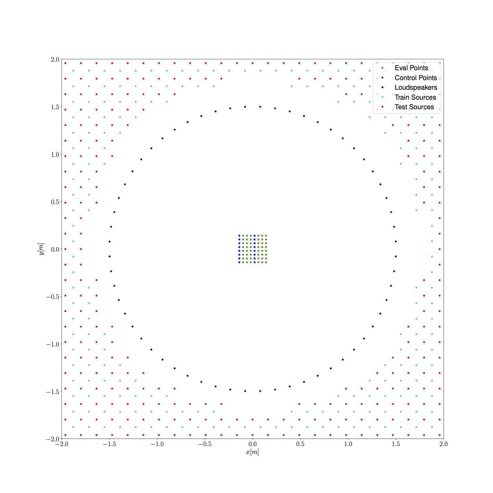

# Irregular Circular Array Results (Real Measurements)
[Home](/deep_learning_soundfield_synthesis_irregular_array/index.html) 

In this page we show results corresponding to reproduction of a single source when using the deep learning-based model presented in  [[1]](#references), denoted as CNN, the Model-based rendering technique presented in [[2]](#references) denoted as MR, the pressure-matching approach [[3]](#references) denoted as PM and the adaptive wavefield synthesis technique[[4]](#references), denoted as AWFS. We also present results related to an adaptive version of MR denoted AMR. We consider a regular loudspeaker array of 64 elements and randomly remove 16,32, and 48 loudspeakers, ending with a 48,32,16 element array, respectively. The data presented here is generated through real measurements of Room Impulse Responses contained in [[5]](#references).

# Training/test setup
In the image we show the setup used to generate the training and test data.

## Ground truth

## 48 loudspeaker setup

## 32 loudspeaker setup

## 16 loudspeaker setup

# References
>[1] Comanducci, L. Antonacci, F., &  Sarti. A., Synthesis of Soundfields through Irregular Loudspeaker Arrays Based on Convolutional Neural Networks [[arXiv preprint]()].

>[2] Bianchi, L., Antonacci, F., Sarti, A., & Tubaro, S. (2016). Model-based acoustic rendering based on plane wave decomposition. Applied Acoustics, 104, 127-134.

>[3] Nelson, P. A. (1994). Active control of acoustic fields and the reproduction of sound. Journal of Sound and Vibration, 177(4), 447-477.

>[4] Gauthier, Philippe-Aubert, and Alain Berry. "Adaptive wave field synthesis with independent radiation mode control for active sound field reproduction: Theory." The Journal of the Acoustical Society of America 119.5 (2006): 2721-2737.

>[5] Zhao, S., Zhu, Q., Cheng, E., & Burnett, I. S. (2022). A room impulse response database for multizone sound field reproduction (L). The Journal of the Acoustical Society of America, 152(4), 2505-2512.

### Support or Contact
For any information regarding the paper or the code send us an email at <luca.comanducci@polimi.it>!

